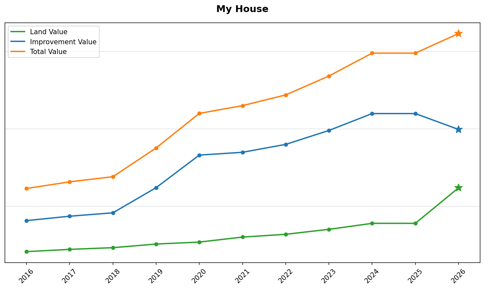
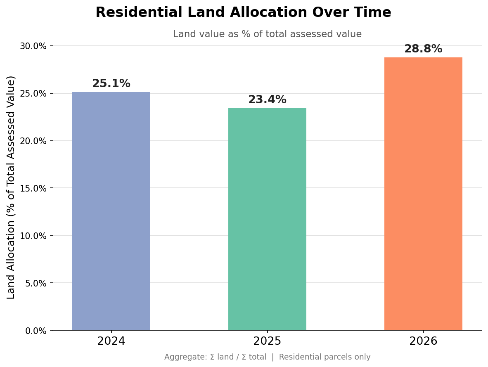
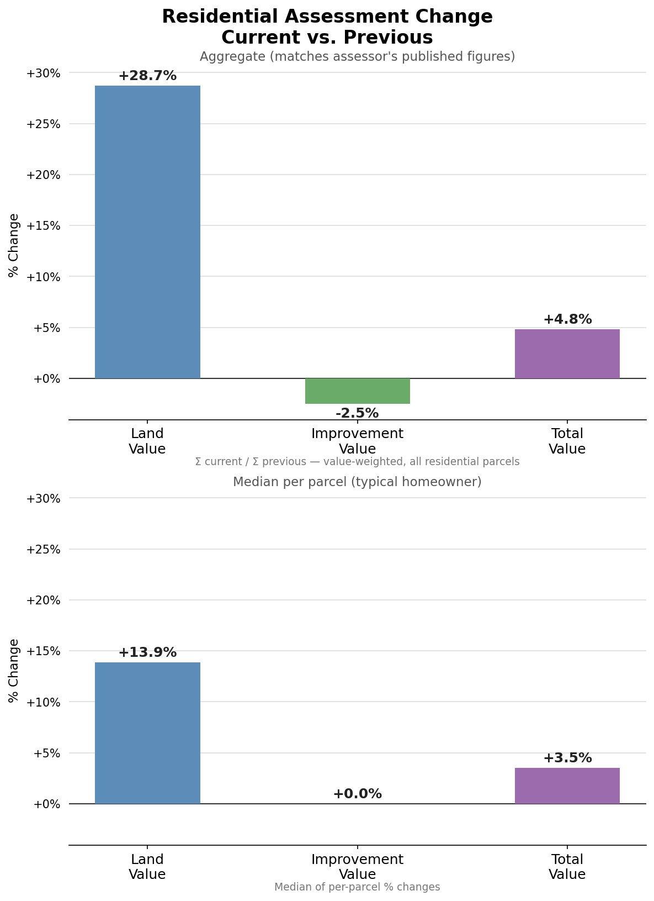
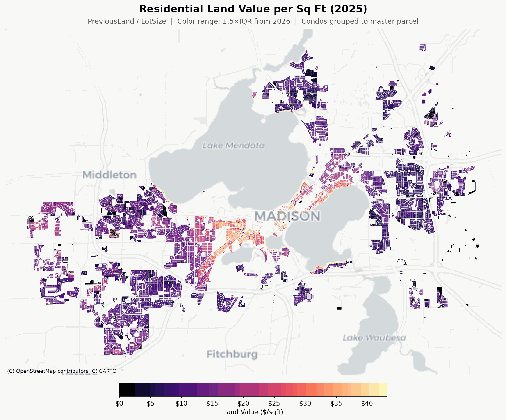
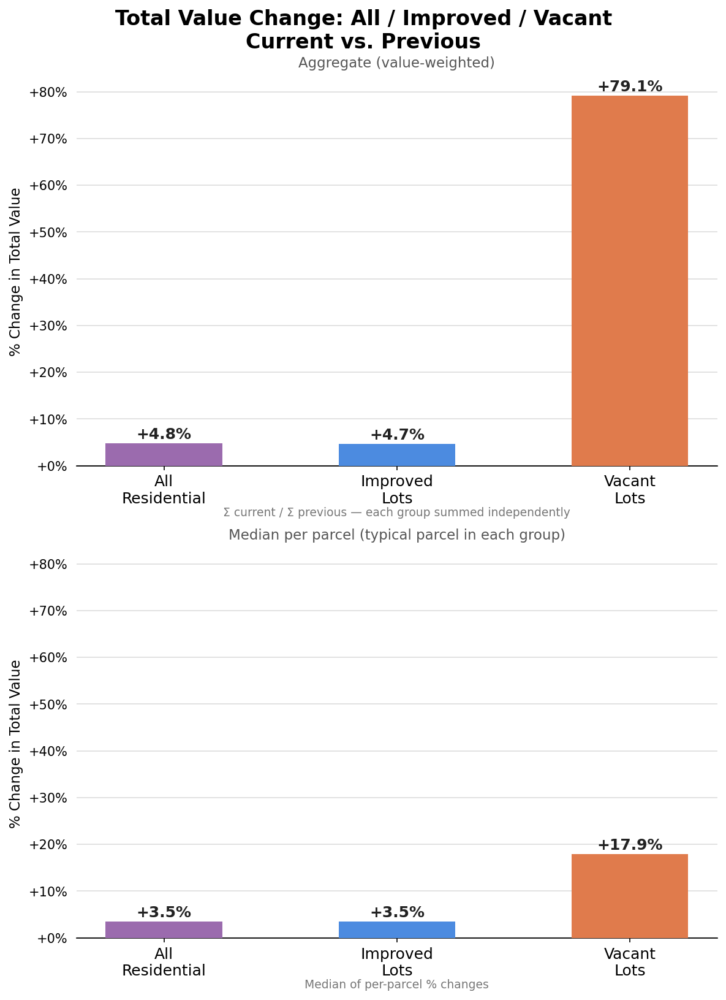
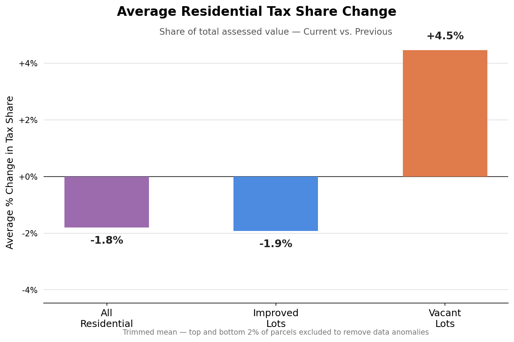
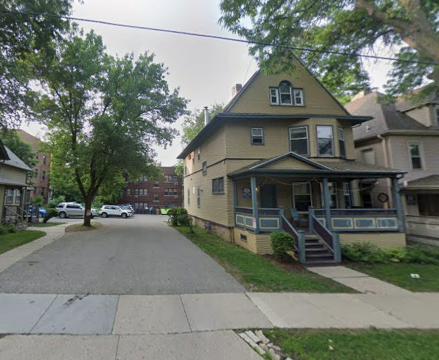
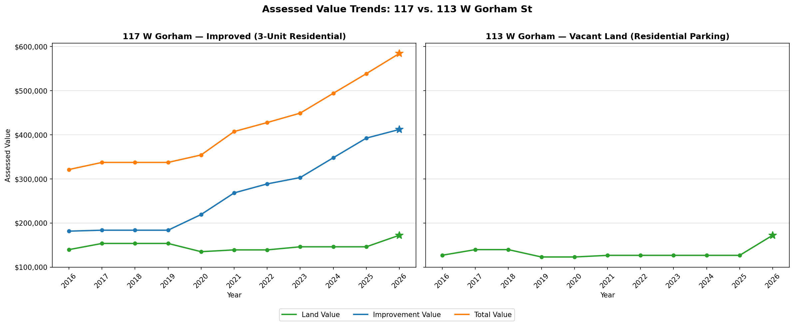
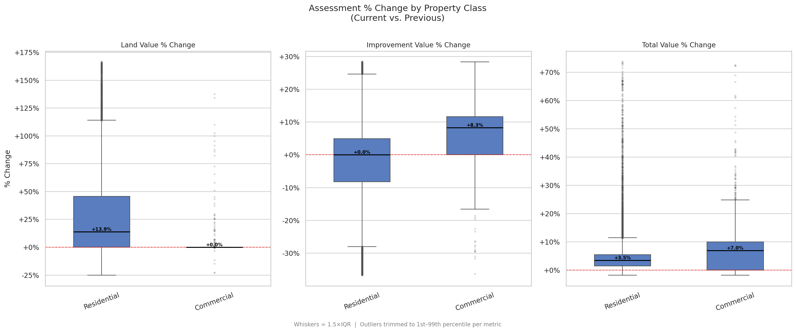
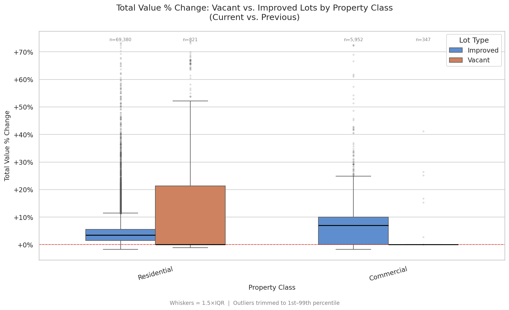

## Intro

The 2026 assessments were released earlier this month in Madison, WI. At the surface, it’s business as usual. City-wide assessments are up 6% and residential assessments are up 4.8%, which I would consider normal. If you’re a homeowner and you looked a little closer, you’ll notice something very different this year. My improvements went down for the first time since buying my home in 2019 (sorry for the flex) and my land increased so much that my property’s total value still rose by 8.5%.

Look at that land value change!

For my house, the land allocation (the % of land value of the total value) increased from 26% to 38%! Was this just me or did this happen elsehwere? We'll get a sense by checking how land allocation has trended for all residential property assessed in the city.

This is a sharp change from the 2024 and 2025 values. On average, land makes up almost 29% of residential property values, and we know that residential total values have increased, so land values must have changed significantly.

As a Georgist (more on this later), this really excites me. We’ll look at how this plays out across the city and what the implications are for land to be valued more accurately. First, let’s talk about property taxes.

## Property Tax 101

Most people assume that increasing property values result in higher property taxes, but it’s more complicated than that. First, the city sets a levy, which is the total amount to be raised by property taxes. Wisconsin limits levy growth by indexing it to net new construction (new buildings - demolished buildings) or requires levy increases to be approved by a referendum. This means that a municipality that doesn't build much will have a harder time keeping up with inflation for its expenses. Madison recently passed a slew of referenda for the city’s operating budget and the school district’s capital/operating budget (the school referenda will make up the largest future increases in our property taxes).

Once we have the levy, it’s split across all taxable parcels in the city based on the assessed value. Properties with higher value bear a high proportion of the levy and vice versa. So when you look at your new assessment, you need to understand how your property’s value increased relative to all other taxable property in the city. Think of it as your property having a slice of the levy pie. The last piece of the puzzle is the mill rate: divide the levy by the total value of assessed properties, which is multiplied by your property's value to get the tax bill.

Above I mentioned that on average, property increased by 6% and my property value rose by 8%, so I can expect that my slice of the pie increased this year compared to last year. Absent levy increases, I can expect my property taxes to rise by 2%. This is fine by me because I love property taxes. If your property value increased by less than 6%, you might even see your taxes fall even with levy increases.

Your property’s value is divided into two pieces: land and improvements. For residential properties, improvement comprises the house/building/whatever you want to call it. The land is the dirt. For our current property tax regime, the difference doesn’t have a lot of meaning at face value because we’re required by state law to distribute the levy based on the total value.

## Land Values in 2026

Let’s take a closer look at how assessments changed for residential properties, including the land and improvement components. 

Look at that land value!

As I’ve said before, residential property values are up 4.8%, and the uncharacteristic pieces: improvements are down 2.5% and land is UP 28.7%. Using my house as an example, my improvements decreased by 9% and my land increased by 59% (total value up 8.5%). I wanted to match the same method the assessor uses to publish their summary for credibility on the basis of my analysis, but I also wanted to show the median changes. We can see that our median land value change is around half the mean, indicating a long tail on the distribution. This makes sense, this round of assessments was a large market correction on the land value, so changes will naturally be drastic.

Land is a big deal here. You might be asking, what the heck gives land value?

We’ll keep this simple and focused on residential property, but know that there are more details to dive into [link to P&P stuff]. Improvements are expected to be valued based on the cost of construction for the structure minus depreciation. Land, on the other hand, does not depreciate. Land’s value is derived from its proximity to amenities and scarcity (aka location location location). In Madison, you’ll find land value is gigantic downtown because of the proximity to lakes, jobs, restaurants, etc. As you move away from downtown, land values typically drop.

Let’s think through my own property. My house was built in 1940 and is lovely and I’m lucky to have it, but the depreciation aspect is real. The windows are old, the insulation isn’t the best, my roof is almost 20 years old, so it’s reasonable to expect that there’s depreciation at play. My land (aka location), on the other hand, is great. I’m on the near west side of Madison, very close to the Southwest Commuter bike path, Hilldale Mall, and the Sequoya library. I’m lucky to live in an amenity-rich area, and my land should reflect that value. To illustrate where land is most valuable in Madison, take a look at this map.

I landed on using a GIF to illustrate land value changes between 2025 and 2026. If you look at this, you can see which spots get "brighter" on our color gradient. We see that central neighborhoods on the near west/east sides saw the largest increases in residential land value per square foot. This makes sense, these are high demand areas and that demand will naturally be reflected in the land value. The value is derived from the accumulation of jobs, nice restaurants, improved infrastructure, etc. All things contributed by the community or tax dollars.

## How Vacant Lots are Impacted

We have 1,417 vacant residential parcels in Madison, which makes up ~2% of our total residential parcels (72,361). I won't comment on how this compares to other cities, but nevertheless it presents at least some opportunity for increasing housing supply. I'll come back to an estimation later.

You can reasonably expect that between two parcels that are the same shape, same size, same block, and same allowed use, they should have a similar land value. This is true between improved parcels and vacant parcels, which are only made up of land value. With our improved parcels now having higher land values, does it hold true that the vacant parcels now have higher total value? Yes! We see this to be true city-wide, where vacant parcels’ total value is up by a lot.

The vacant parcel data is highly susceptible to outliers, so I'm showing the aggregate weighted mean (79.1%) to match the type of calculation the assessor would do, and median (17.9%) to reflect the typical vacant parcel. This means that many vacant residential parcels will see higher property taxes next year because now their slice of the levy pie is larger than it was last year.

We actually see that residential properties as a whole will see a decreased share in the levy, while those vacant lots will experience a larger share of the taxes compared to 2025.

## Why Accurate Land Valuation Matters

Now I’m going to do a little dive into an old, but resurging, set of ideas from Henry George. In the late 1900s, Henry George observed that during a time of progress with the industrial revolution, there was an ever increasing rate of poverty. He surmised that land owners in a thriving area saw incredible financial windfalls as industry surged around them. This progress increased demand to live in these industrious areas, and with it rents rose due to rising land values. Land lords were able to privatize the increased land value without contributing to the conditions of success, essentially sapping the wealth generated by the community. Similarly, owners of vacant land can hold onto it waiting for it to have a future higher value and sell at a profit, again without any effort required to reap the benefits of rising land values. This is called land speculation and I don’t think it controversial to say that this is undesirable behavior. Henry George’s suggested solution was simple: tax the rental value of the land, a.k.a land value tax. The structure of this tax means that the speculative gains from land are taxed and justified by the fact that the land value is a result of the community’s effort and tax dollars, and as such, that value should be returned to the community.

Back to modern times, we see land speculation happening in holding vacant land. I’m not here to say that the people that hold this land are maliciously participating in land speculation, but the fact remains that by holding this land unused as it gains value, land speculation is happening regardless. By accurately valuing land, we’re increasing the holding costs of land, which puts pressure on vacant land owners to sell to someone willing to use the land. Property taxes are partially land value taxes already, so any increase in the holding costs for land directionally reduces land speculation. Even though vacant parcels are going to see higher taxes, the tax bill will still be smaller than nearby improved parcels.

Let's take a look at two lots on Gorham St in downtown.

Here we have a rental 3 unit townhouse next to a vacant lot (used for parking). The total value of the townhouse has been rising steadily over time, while the vacant lot has been largely static over the last few years. 2026 shows a big change. For one, the land values match between the two lots now, which makes sense. The total value of the townhome increased slightly above the city-wide average, so taxes will increase slightly. The vacant lot on the other hand, will see a more substantial tax increase because its total value increased by 36%. The important takeaway here is that the overall value of the improved lot increased by ~8.5%, while the overall value of the vacant lot increased by 36%. This will increase the tax burden on the vacant land.

If we consider the tax bills for these properties in 2025, the 3-unit townhouse paid \$9,957.01 in taxes. The vacant parking property next door paid \$2,363.74. The townhouse gets charged more than 4 times the amount for property taxes. Bluntly, the parking lot gets a tax break by not having a building on it. Is this really the financial incentive structure we want in a city that needs more housing?

## Property Taxes are 50% Good

I said before I love property taxes, but that’s only 50% true. The tax on land is great. The tax on improvements, not so much. A significant source of housing unaffordability is due to constrained supply, and for anyone that has spent any time reading about housing, there are familiar barriers to this like zoning. A tax on improvements is a lesser known disincentive on housing supply. If you tax something you get less of it. Taxing buildings means we’ll get less building. Land on the other hand, is in fixed supply, so taxing land more will not result in less land, but more efficient land use. For the existing homeowner, this means that you’re disincentivized from adding a new bedroom/bathroom because your property taxes will probably increase. If you’re from Madison, you’re probably familiar with the very old rental houses on W Washington Ave. The proximity to downtown lets the land lords maintain higher rents, especially absent adequate supply. The landlords can charge market rent because of demand, but if they maintain the houses adequately, that will increase the improvement value, which can increase their property taxes. The current property tax structure is punishing people for building and improving, and rewarding people for neglecting and holding.

While it’s not a full land value tax, I’m in support of a universal building exemption or split-rate tax. This would have different rates for taxing improvements and land, pushing us in the direction of discouraging land speculation and encouraging good use of land. For example, a universal building exemption would be 0% on improvements and 100% on land. Pennsylvania is the classic example of municipalities that have had split rate taxes, like 30% tax on improvements and 70% tax on land. One precursor to these reforms is accurate land valuation, so we’re making progress! There are likely legal hurdles that need to be evaluated, but that’s a topic for the future.

## Appendix - Distributions

Some of you probably want to see some distributions instead of averages, I’m here for you:

 

Distribution of these changes:

